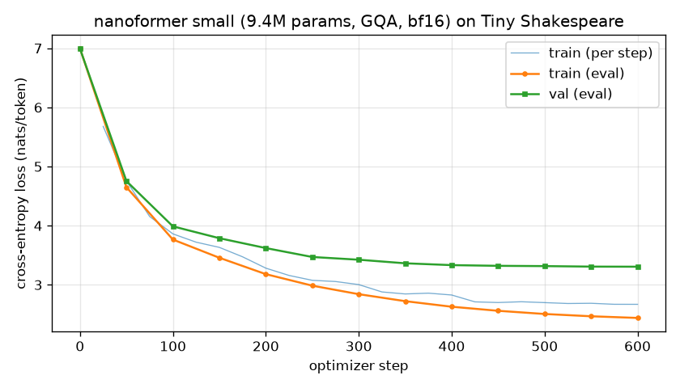

# nanoformer · a Transformer from scratch

A LLaMA-style decoder-only Transformer written from first principles in PyTorch, with the
full training/inference stack around it: byte-level BPE tokenizer, AMP trainer with exactly
resumable checkpoints, KV-cached sampling, and a test suite that checks the *mathematical
properties* of each component rather than just shapes.

**Why this project exists.** Anyone can call `nn.TransformerDecoderLayer`. This repo shows I
can build, verify and train the pieces that production LLMs are made of — RMSNorm, rotary
embeddings, grouped-query attention, SwiGLU, KV caching, mixed precision, cosine schedules —
and explain every design choice.

| | |
|---|---|
| Quality gates | `ruff` (lint + format), `mypy --strict`, **131 tests**, **98.9 % branch coverage** |
| Runtime | PyTorch ≥ 2.4, CPU or CUDA, Python ≥ 3.12 |
| Demo result | 9.4 M-param model, Tiny Shakespeare, **val loss 3.31 nats/token (ppl 27.3)** in **65 s** on an RTX 4070 |

---

## 1. Architecture

```
tokens ─► Embedding ─► ┌───────────────── × n_layers ──────────────────┐ ─► RMSNorm ─► LM head (tied)
                       │ x + Attn(RMSNorm(x))      x + SwiGLU(RMSNorm(x)) │
                       │      │                                           │
                       │  RoPE(q,k) → [KV cache] → GQA causal SDPA        │
                       └──────────────────────────────────────────────────┘
```

| Component | File | Choice and rationale |
|---|---|---|
| Normalisation | `layers.py::RMSNorm` | RMSNorm (no mean-centring, no bias) — cheaper than LayerNorm, equivalent quality at scale; statistics computed in fp32 under autocast. |
| Positions | `layers.py::apply_rope` | Rotary embeddings applied to q/k *before* caching, so cached keys never need re-rotation. Relative-position property `<RoPE(q,m), RoPE(k,n)> = f(m−n)` is unit-tested. |
| Attention | `layers.py::CausalSelfAttention` | Grouped-query attention (`n_kv_heads < n_heads`) shrinks the KV cache by `n_heads / n_kv_heads`. Fast path: `F.scaled_dot_product_attention`; a textbook reference implementation is kept and the two are tested for equality (MHA, GQA, MQA, with and without cache). |
| MLP | `layers.py::SwiGLU` | Gated MLP with hidden size `2/3·4d` rounded to a multiple of 64 (LLaMA rule), so parameter count matches a classic 4d MLP. |
| Block | `layers.py::TransformerBlock` | Pre-norm residuals: the residual stream is an identity path, which is what makes deep stacks train without tricks. |
| Init | `model.py` | N(0, 0.02) everywhere; residual output projections scaled by `1/√(2·n_layers)` (GPT-2) so activations do not grow with depth. Tied input/output embeddings. |
| KV cache | `cache.py::KVCache` | Pre-allocated `[B, kv_heads, max_len, head_dim]` per layer; O(T) writes instead of O(T²) `torch.cat` growth. Incremental decoding is tested to match a full forward pass to 1e-5. |
| Tokenizer | `tokenizer.py::BPETokenizer` | Byte-level BPE trained from scratch (GPT-2-style pre-tokenisation regex, deterministic tie-breaking). Any string round-trips; special tokens are only honoured when explicitly allowed (safe for untrusted input). |
| Trainer | `trainer.py::Trainer` | bf16/fp16 autocast + GradScaler, gradient accumulation, clipping, AdamW with decay/no-decay groups, warm-up + cosine LR, JSONL metrics, best-val checkpoint, **bit-exact resume** (optimizer, scaler and every RNG are checkpointed). |
| Sampling | `generate.py` | Temperature, top-k, top-p (nucleus), EOS handling per row, KV-cached loop; cached and uncached greedy decoding are tested to produce identical tokens. |

---

## 2. Results

Setup: `configs/small.yaml` — d_model 384, 6 layers, 6 heads / 2 KV heads, context 256,
vocab 1024 (BPE trained on the corpus), dropout 0.2, bf16 autocast, AdamW (0.9, 0.95),
lr 6e-4 → 6e-5 cosine with 60 warm-up steps, batch 64 × 256 = 16 384 tokens/step.

| Metric | Value |
|---|---|
| Non-embedding parameters | 9,442,176 |
| Tokenizer | 1024-symbol byte-level BPE, 2.41 chars/token, trained in 22 s |
| Corpus | Tiny Shakespeare, 463 569 tokens (415 345 train / 48 224 val, contiguous split) |
| Steps × tokens | 600 × 16 384 ≈ 9.8 M tokens (≈ 24 epochs) |
| Throughput | ≈ 225 k tokens/s on RTX 4070 (bf16, SDPA flash kernel) |
| Wall-clock | 65 s |
| **Validation loss** | **3.306 nats/token → perplexity 27.3** (≈ 1.37 nats/char, in the range of nanoGPT's char-level 1.47 on the same corpus) |



Sample (`ROMEO:` prompt, temperature 0.8, top-k 50, from `ckpt_best.pt`), see
[docs/sample_generation.txt](docs/sample_generation.txt):

```
ROMEO:
Do not be mutinent.

MERCUTIO:
The doubtless heart the wisdom of thy power.

BENVOLIO:
What then?
```

### What happens if you just train longer

The first run used 3 000 steps (≈ 120 epochs of a 415 k-token corpus). Train loss fell to
0.09 while validation loss climbed from its minimum of 3.32 (step ≈ 500) to 6.30, and the
samples became verbatim Shakespeare — the model memorised the corpus. That run is kept as
[docs/loss_curve_overfit_3000steps.png](docs/loss_curve_overfit_3000steps.png); it motivated
best-validation checkpoint selection (`ckpt_best.pt`) and dropout 0.2 in the final config.
In the data-limited regime, tokens — not parameters or steps — are the binding constraint.

---

## 3. Tests: what each one proves

`pytest` runs in ≈ 5 s on CPU. Highlights (see `tests/`):

| Test | Property verified |
|---|---|
| `test_attention::test_fused_kernel_matches_reference` | SDPA fast path == textbook softmax(QKᵀ/√d)V for MHA, GQA and MQA, with and without a cache. |
| `test_attention::test_no_information_leaks_from_the_future` | Perturbing tokens after position *i* leaves logits ≤ *i* unchanged (causality). |
| `test_layers::test_relative_position_property` | RoPE scores depend only on `m − n`. |
| `test_cache::test_incremental_decoding_matches_full_forward` | Prefill + one-token steps reproduce the full-sequence logits. |
| `test_model::test_param_count_matches_closed_form` | Parameter count equals the analytic formula for tied/untied and MHA/GQA. |
| `test_model::test_initial_loss_is_close_to_uniform` | Loss at init ≈ ln(vocab) — the init is sane. |
| `test_trainer::test_resume_is_bit_exact` | 6 steps == 3 steps + checkpoint + reload + 3 steps, weight for weight. |
| `test_trainer::test_model_overfits_a_predictable_stream` | The whole loop can drive loss from ln 16 to < 0.3 on a cyclic stream. |
| `test_generate::test_cached_and_uncached_greedy_agree` | The KV-cache path is not silently wrong. |
| `test_tokenizer::test_round_trip` | Unicode, emoji, whitespace-only and never-seen strings all round-trip. |

---

## 4. Reproduce

```bash
pip install -e ".[dev]"                       # CPU torch is enough for the tests
pytest                                        # 131 tests, coverage report
ruff check . && ruff format --check . && mypy # lint + strict types

python scripts/download_data.py               # Tiny Shakespeare (1.1 MB)
nanoformer train-tokenizer --input data/tinyshakespeare.txt --vocab-size 1024 --out artifacts/tokenizer_1024.json
nanoformer prepare-data --input data/tinyshakespeare.txt --tokenizer artifacts/tokenizer_1024.json --out-dir data/tinyshakespeare
nanoformer train --config configs/small.yaml  # ~1 min on a consumer GPU; configs/tiny.yaml for CPU
nanoformer generate --checkpoint runs/small/ckpt_best.pt --tokenizer artifacts/tokenizer_1024.json --prompt "ROMEO:"
python scripts/plot_loss.py runs/small/metrics.jsonl --out docs/loss_curve.png
```

Any config key can be overridden on the command line, e.g.
`nanoformer train --config configs/small.yaml --override train.max_steps=200 --override model.n_layers=4`.
Training can be resumed exactly with `--resume runs/small/ckpt_000300.pt`.

---

## 5. Design decisions and trade-offs

* **Reference implementation next to the fast path.** `use_sdpa=False` switches every layer to
  plain matmul attention. It costs nothing in production and turns "is the fused kernel
  doing what I think?" into a one-line test.
* **Explicit RNG ownership.** Data sampling uses its own `torch.Generator`, evaluation uses a
  fresh fixed-seed generator, and all of them are checkpointed. This is what makes resume
  bit-exact and validation losses comparable across steps.
* **Naive BPE training.** O(merges × unique words) — 22 s for this corpus. Production
  tokenizers keep incremental pair counts; I chose readability over speed because the
  algorithm is the point here, and documented the limit.
* **No `torch.compile` by default.** It is a flag (`train.compile`) but off, because the
  Windows/Triton story is fragile and a small model is launch-bound anyway.
* **What I would add at scale**: FlashAttention-2 / paged KV, FSDP or tensor parallelism,
  fused AdamW, sequence packing with document masks, and a proper data loader with
  deterministic sharding.

See [docs/INTERVIEW_NOTES.md](docs/INTERVIEW_NOTES.md) for the questions this project is
built to answer.

---

## Related projects

This repository is one of three standalone projects that together cover a Transformer's
life-cycle — build it, adapt it, serve it — all held to the same engineering standard
(ruff, `mypy --strict`, offline CPU test suites with coverage gates, matrix CI):

* **transformer-from-scratch** (`nanoformer`) — a LLaMA-style decoder, byte-level BPE and an
  AMP trainer with bit-exact resume, written from first principles.
* **lora-finetune-eval** (`loraeval`) — LoRA implemented from scratch and a statistically
  rigorous evaluation harness, applied to financial sentiment classification.
* **llm-inference-server** (`llmserve`) — KV-cached batched generation, dynamic batching,
  INT8, Prometheus metrics, FastAPI and Docker for any Hugging Face causal LM.
